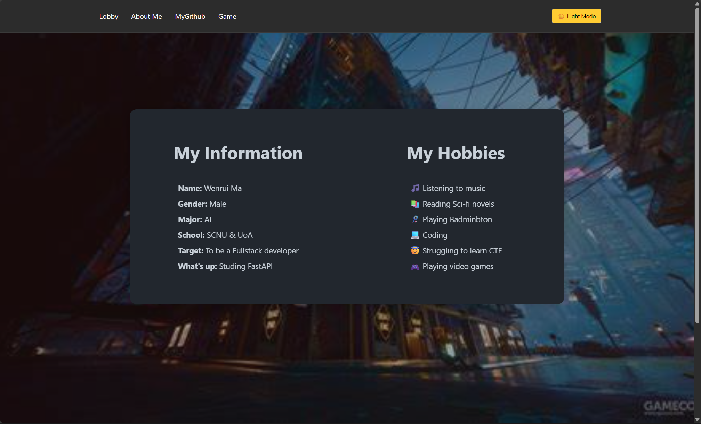
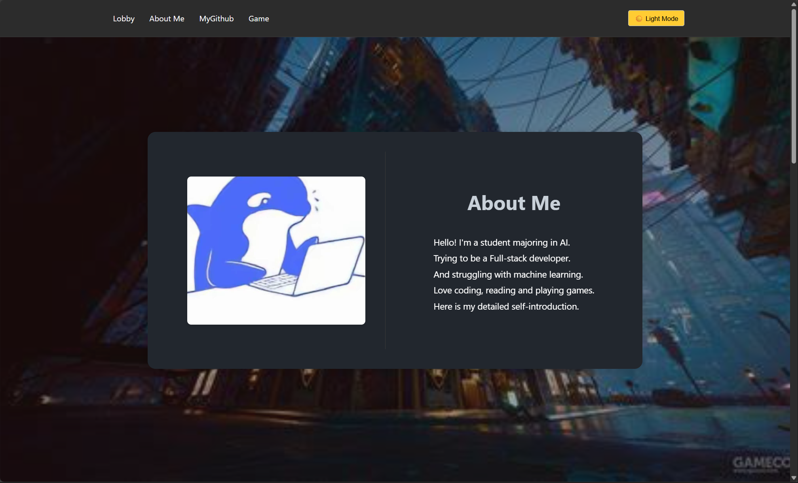
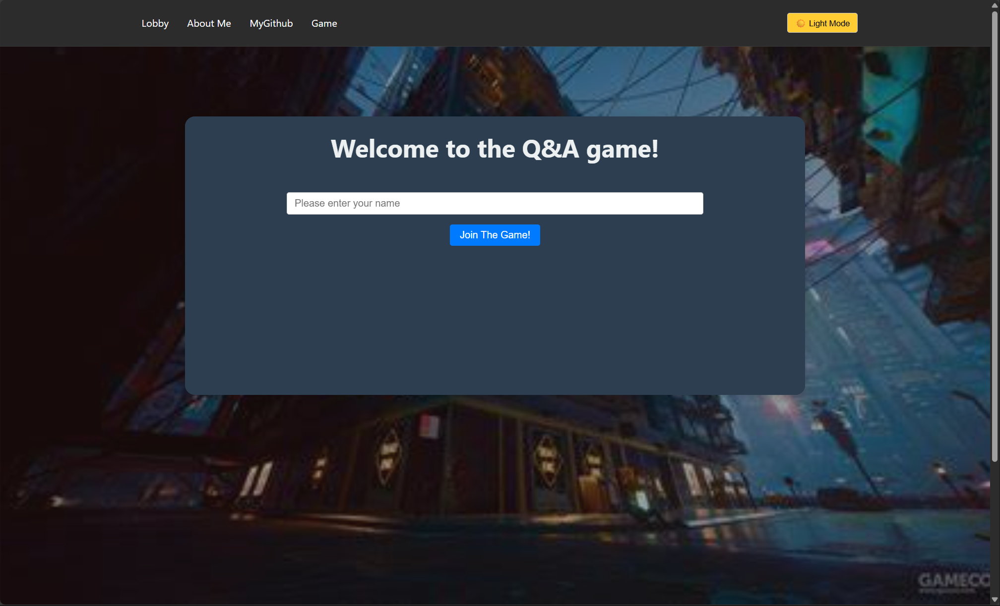

# Web Coursework Report

## There's something I'd like to say in advance

This is not the version I intended to upload. I'll explain the reason in the subsequent report. If you're curious about the version I really wanted to upload, you can visit the following link:

    https://github.com/MCandOTHER/WebCoursework

## Introduction of the whole website

### i. Front-end page structure

The website is conposed of **index.html** as the roott page, and **about.html** to intorduce more about my personal information, and **quiz.html** to offer a small game as required.

- **Introduction（index.html）**: The introduction page is a simple one displaying personal info-related web content, comprising a navigation bar with custom styles (including "Lobby", "About Me", "MyGithub", "Game" links and a dark mode toggle button), a main content area with background and an intro container (showing personal info on the left and hobbies on the right in a card), and a footer with contact info (WeChat and Github accounts).

- **About Page（about.html）**: - **About Me（about.html）**: The about page delves deeper into personal details and interests. It mainly consists of a main content area. The main content area features a series of left-image and right-text displays. Each section is presented within an `intro - container` and an `intro - card`. The about.html page comprehensively presents my personal information, special experiences, and interests through a well - structured layout.

- **Quiz（quiz.html）**: The quiz page provides a small Q&A game, which enables two player to play online. Two points will be added for answering a question correctly, and one point will be added to the opponent for answering a question incorrectly. The player who answers the question correctly first gets the points. The player who reaches ten points first wins the game. I used the `display: none` property extensively when completing this page, and achieved dynamic display through `script.js`.
  

- **Style Sheets (style.css, about.css and quiz.css)**: The `style.css` is the global stylesheet that resets element box models, sets basic styles, implements responsive navigation bars, dynamic background cards, and footers, and supports dark mode switching and animation effects for the back-to-top button. The `about.css` for the about page sets image animations, text styles, and dark mode adaptation, and collaborates with global styles to achieve responsive design. The `quiz.css` for quiz games that defines UI elements, and supports dark mode and interactive animation effects.

- **Universal Scripts (script.js)**: The `script.js` provides the feature of changing color modes, stores the color user chose, and provides support to the fade-in effect.

- **Quiz Page Scripts (quiz.js)**: The `quiz.js` provides Socket.IO-powered multiplayer trivia front-end supports and use function like `showScreen` to control . Connects, manages state, uses `showScreen` to dynamically control the display of the game page.
  
### ii. Back-end details

The `server.js` is an online server based on Express and Socket.IO. Players can join the game through Socket connections and challenge other players. Once a challenge is accepted, the game starts, and 10 questions are randomly selected. Players answer the questions. If a player answers correctly, they get 2 points; if they answer incorrectly, the other player gets 1 point. The results of each round are sent to the players. The game ends when a player reaches 10 points or all questions have been answered.

#### Client-Server Communication

Leverage Node.js and Socket.IO to enable real-time communication between the client and server. The server is built using the Express framework, created via the `http` module, and uses Socket.IO to monitor client connections. The client establishes a connection with the server by importing `socket.io.js`.

#### Event Handling Mechanism

- **Player Connection**: The server listens for the `connection` event when a new client connects. After a player inputs their name and clicks the "Join The Game!" button, the client sends a `join` event to the server. The server then stores the player's information in the `players` Map and broadcasts the updated player list to all clients.

- **Challenge Request**: When a player clicks the challenge button in the player lobby, the client sends a `challenge` event to the server. The server then forwards a `challengeRequest` event to the target player. The target player can choose to accept or reject the challenge upon receiving it.

- **Answer Submission**: After a player selects an answer in the game interface, the client sends an `answer` event to the server. The server evaluates the answer, updates the scores accordingly, and then sends a `roundResult` event to all players.

## Reflection Section

### Challenges Faced During Development

- **Difficulty with animation and style switching**: At first, I tried using IDs to select a specific div with a particular ID as the background color for switching. However, I later found that there were too many containers needing color changes. To complete the assignment quickly and minimize bugs, I had to repeatedly select multiple IDs and classes, resulting in an overly lengthy function for toggling between light and dark themes.

- **CSS Validation Issues**: At first, the website used **Bootstrap v3.4.1**, which I can use it proficiently, but when I uploaded all the progress of my front-end work and tried to pass the CSS validation, I found that there were 200 warnings and errors in the Bootstrap I referenced. Faced with the dilemma of either resolving the errors in the official version of Bootstrap or rewriting the entire website with a similar style without using Bootstrap, I ultimately decided to rewrite it. I submitted the new version to a new repository and saved the original website that used Bootstrap on GitHub.

- **Chaos in backend processing logic**: When writing `server.js`, my thought process was overly disorganized, leading me to write functions that weren't actually used. I even attempted to use timers to broadcast the `playerList` at fixed intervals.

### Solutions and Lessons Learned

- **Should not overly rely on Bootstrap**: Due to over-relying on my previous experience in building websites, I encountered numerous issues during CSS validation. In the future, if given the opportunity, I should attempt to use more diverse frameworks for web development.

- **Think before start**: When writing the backend `server.js`, I should pre-plan the logic for handling various frontend requests and services, and only implement functions that are truly necessary.

## References

- [Express Official Documentation](https://expressjs.com/)
- [Socket.IO Official Documentation](https://socket.io/)
- [Node.js Official Documentation](https://nodejs.org/)

## GenAI Usage Declaration

This report uses the generative AI tool Doubao for content proofreading and optimization of some sentences. The main content are all independently completed by myself. A very small portion of the code and the `package.json` was suggested for optimization by Claude 3.5 Sonnet and has been separately marked
